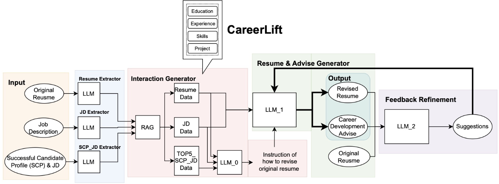

# CareerLift: An Intelligent Resume Enhancement Tool Powered by Large Language Models.

CareerLift helps job seekers optimize their resumes by analyzing them against successful candidate profiles and specific
job requirements, while also providing actionable career development advice. The tool leverages a feedback loop to
ensure the reliability of its outputs, increasing candidates' chances of securing desired roles.

---


## Features

- **Intelligent Resume Optimization**: Analyzes resumes and job descriptions to produce highly tailored resumes.
- **Career Development Suggestions**: Offers specific, actionable advice to support long-term career planning.
- **Iterative Feedback Mechanism**: Continuously refines resumes to ensure professional quality and relevance.
- **Data-Driven Matching**: Uses 60 successful candidate profiles as benchmarks to deliver personalized advice.

---

## User Interface

The web interface provides an intuitive way to interact with CareerLift:

1. **Input Fields**:
    - Paste job descriptions and resumes in plain text.
    - Upload raw or related data directly.

2. **LLM Provider Selection**:
    - Choose from supported LLMs (e.g., OpenAI).

3. **Role Selection**:
    - Specify the target role (e.g., SDE, DS, MLE).

4. **API Key**:
    - Securely input your API key for LLM access.

5. **Actions**:
    - **Get Resume**: Generates a tailored resume.
    - **Get Advice**: Provides actionable career advice.
    - **Run CareerLift**: Runs the complete pipeline for both resume and advice.

6. **Results**:
    - The results, including optimized resumes and advice, are displayed directly in the interface.

---

## Installation

### Requirements

- Python 3.10+
- Required Python packages are listed in `requirements.txt`.

### Installation Steps

1. Clone the project repository:

   ```bash
   git clone https://github.com/ece1786-2024/CareerLift.git
   cd CareerLift
   ```

2. Install dependencies:

   ```bash
   pip install -r requirements.txt
   ```

---

## Usage

### Running the Application

1. **Start the Application**  
   Run the following command in the project directory to start the application:
   ```bash
   python app.py
   ```

2. **Open the User Interface**  
   Open the default URL in your browser: `http://127.0.0.1:5000`.

3. **Input Basic Information**  
   Once the UI is loaded, follow these steps:
    - Enter the **Job Description (JD)** and **Resume**.
    - Input your **OpenAI API Key**.
    - Select the target **Role** (e.g., SDE, DS, or MLE).
   > **Tip**: For quicker setup during testing, click the **Auto Fill** button at the top-right corner.  
   This will automatically populate the JD and Resume fields with sample data, but you will still need to input your API
   key manually.

4. **Run CareerLift**  
   Click the **Run CareerLift** button to start the process. The program will take approximately one minute to complete.

5. **Retrieve Results**
    - **Get Career Advice**: Click the **Get Advice** button to display actionable career advice in the **Result**
      section.
    - **Download Optimized Resume**: Click the **Get Resume** button. A download button will appear, allowing you to
      save the optimized resume in LaTeX format.

---

## Contributing

We welcome all contributions! If you have ideas or improvements, please submit
an [Issue](https://github.com/ece1786-2024/CareerLift/issues) or create a Pull Request.

---

## License

This project is licensed under the [MIT License](https://opensource.org/licenses/MIT).

---

